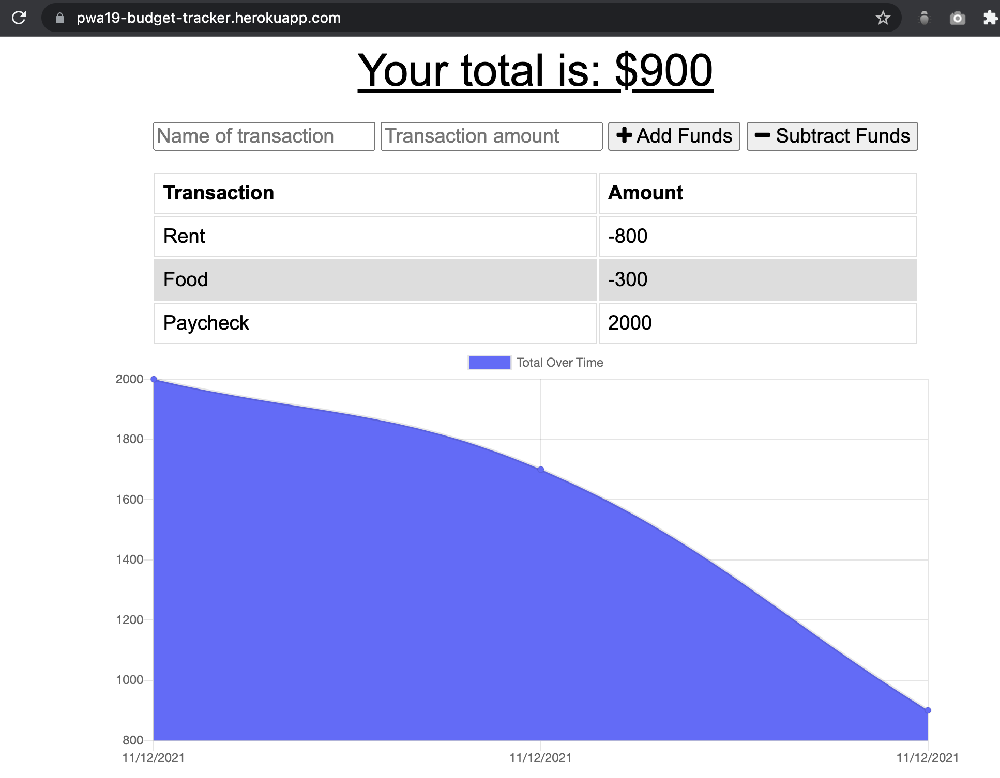
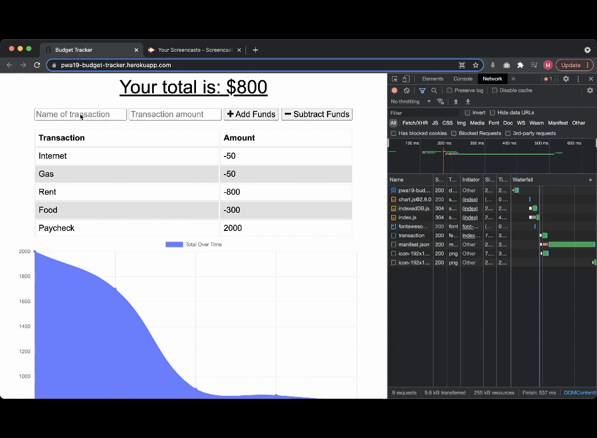

# Online-Offline-Budget-Trackers


## Description

For this project, my task is to add functionality to the existing budget tracker application to allow for offline access and functionality.

## Table of Content

- [URL Link to GitHub Repository](#url-link-to-github-repository)
- [URL link to deploy in Heroku](#url-link-to-deploy-in-heroku)
- [Mock-Up Image](#mock-up-image)
- [Requirements](#requirements)
- [Installation](#installation)
- [License](#license)
- [Questions](#questions)

## URL Link to GitHub Repository

https://github.com/jingwang6028/Online-Offline-Budget-Trackers

## URL link to deploy in Heroku

https://pwa19-budget-tracker.herokuapp.com/

## Mock-Up Image

Homepage

Offline


## Requirements

```
Node.js
Express
npm
Mongoose
MongoDB

```

## Installation

1. For install npm packages, run command:

   ```
   npm i
   ```

2. To run this app
   ```
   node server.js
   ```

## License

This project is licensed under the MIT license.

## Questions

If you have any questions about the repo, open an issue or contact me directly at jingwang6028@gmail.com. You can find more of my work at [jingwang6028](https://github.com/jingwang6028).
